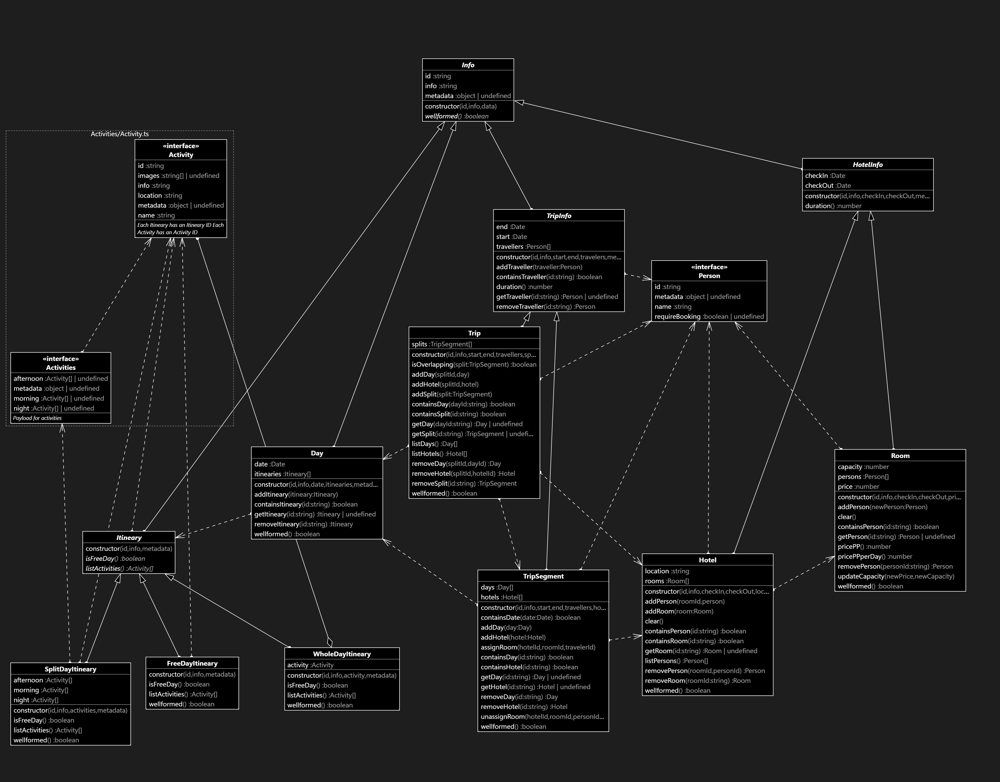
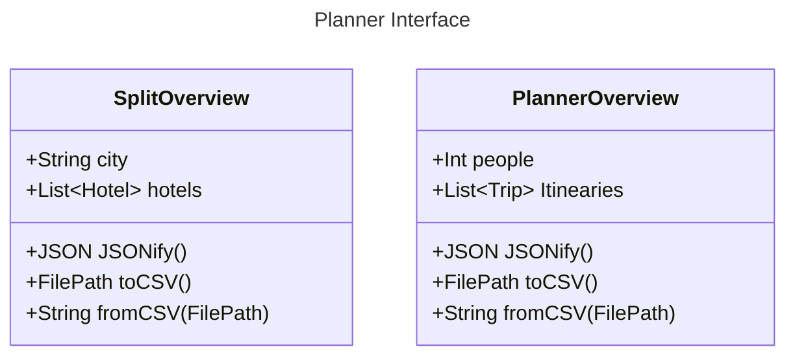

# Itineary Planner

This should provide the tools to plan out an Itneary
## UML of backend

## Routes

|path                                           |description               |method |
|-                                              |-                         |-------|
|/auth/register                                 |registers a user          |POST   |
|/auth/login                                    |validates a user          |POST   |
|/auth/logout                                   |logs a user out           |POST   |
|/trips                                         |lists a user's trips      |GET    |
|/trips/new                                     |Creates empty trip        |POST   |
|/trips/{tripId}                                |Gets a spacific trip      |GET    |
|/trips/update/{tripId}                         |Updates a specific trip   |PUT    |
|/trips/remove/{tripId}                         |Deletes a specific trip   |PUT    |
|/splits/{tripId}                               |Lists all splits in a trip|GET    |
|/splits/new/{tripId}                           |Creates a new split in a  |POST   |
|/splits/get/{tripId}/{splitId}                 |Gets specific split in a  |GET    |
|/splits/update/{tripId}/{splitId}              |Updates a specific split  |PUT    |
|/splits/remove/{tripId}/{splitId}              |Removes a specific split  |DELETE |
|/hotels/{tripId}/{splitId}                     |Lists all hotels          |GET    |
|/hotels/{tripId}/{splitId}                     |Lists all hotels          |PUT    |
|/hotels/{tripId}/{splitId}/{hotelId}           |Update hotel              |PUT    |
|/hotels/{tripId}/{splitId}/{hotelId}           |Removes Hotel             |DELETE |
|/hotels/{tripId}/{splitId}/{hotelId}           |Gets specific hotel       |GET    |
|/room/{tripId}/{splitId}/{hotelId}             |Lists Rooms for a hotel   |GET    |
|/room/{tripId}/{splitId}/{hotelId}             |Lists Rooms for a hotel   |GET    |
|/room/{tripId}/{splitId}/{hotelId}/{roomId}    |Gets specific room        |GET    |
|/room/{tripId}/{splitId}/{hotelId}/{roomId}    |updates specific room     |PUT    |
|/room/{tripId}/{splitId}/{hotelId}/{roomId}    |updates specific room     |DELETE |
|/day/{tripId}/                                 |lists days                |GET    |
|/day/{tripId}/{splitId}                        |list days in a split      |GET    |
|/day/{tripId}/{splitId}                        |add a day to a split      |POST   |
|/day/{tripId}/{splitId}/{dayId}                |Update a day              |PUT    |
|/day/{tripId}/{splitId}/{dayId}                |Removes a day             |DELETE |
|/activity/{tripId}/{splitId}/{dayId}           |Lists activities          |GET    |
|/activity/{tripId}/{splitId}/{dayId}           |Post an activity          |POST   |
|/activity/{tripId}/{splitId}/{dayId}/{activityId} |updates an activity    |PUT    |
|/activity/{tripId}/{splitId}/{dayId}/{activityId} |deletes an activity    |DELETE |
|/itineary/{tripId}/{splitId}/{dayId}           |Lists activities          |GET    |
|/itineary/{tripId}/{splitId}/{dayId}           |Post an activity          |POST   |
|/itineary/{tripId}/{splitId}/{dayId}/{activityId} |updates an activity    |PUT    |
|/itineary/{tripId}/{splitId}/{dayId}/{activityId} |deletes an activity    |DELETE |

## TODO

Back end
- [x] Hotels
- [x] Activities
- [x] Transport
- [ ] Overviews
- [ ] Server interface
- [ ] Refactor to use hashmap
Front end
- [ ] Homepage
- [ ] Hotels UI
- [ ] Activities UI
- [ ] Transport UI
- [ ] Overview
