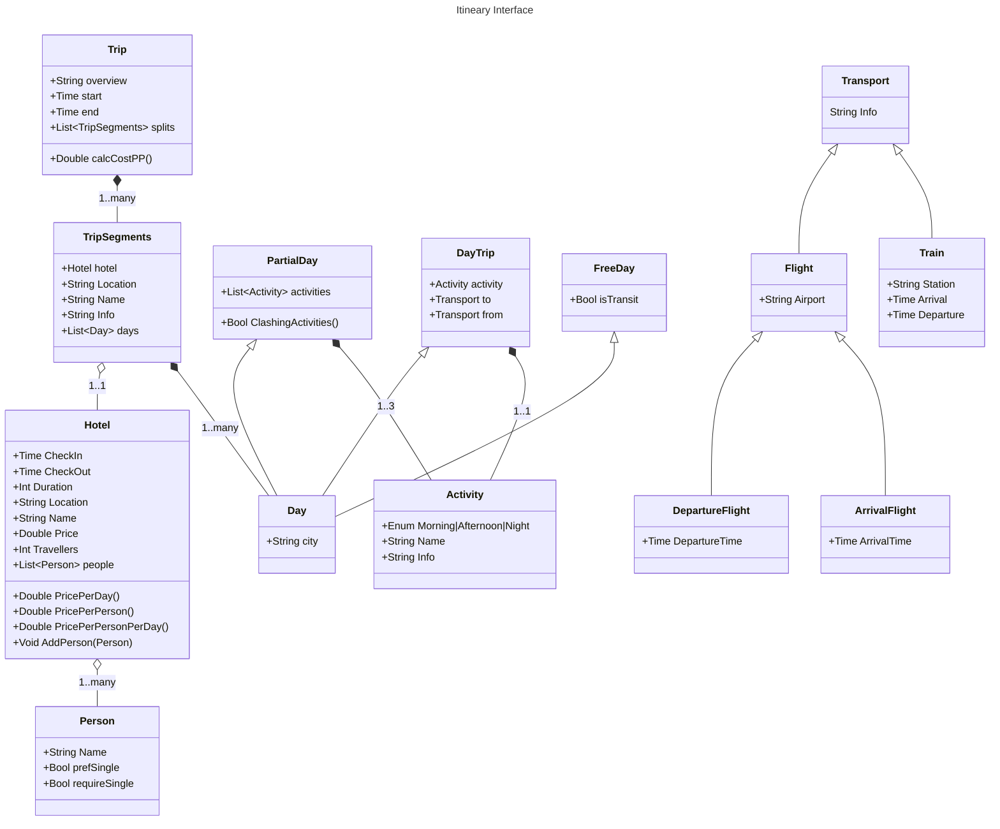
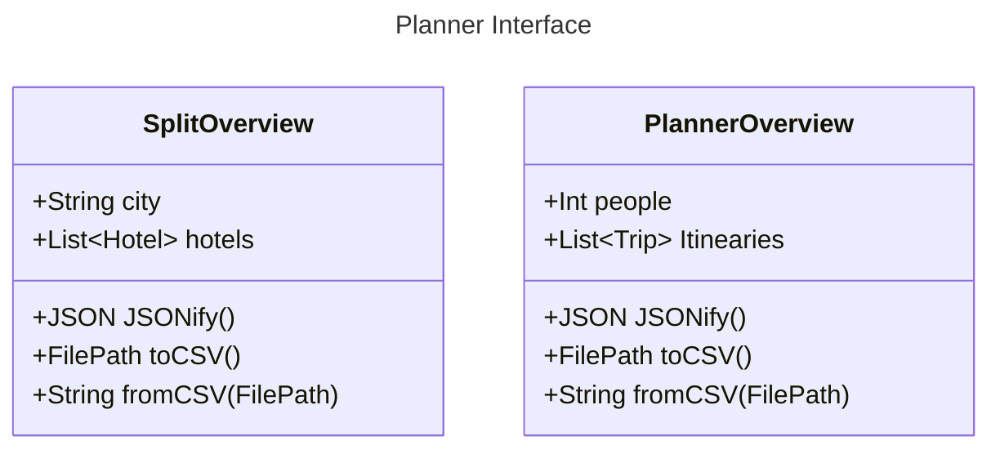

# Itineary Planner

This should provide the tools to plan out an Itneary

## TODO

Back end
- [ ] Hotels
- [ ] Activities
- [ ] Transport
- [ ] Overviews
Front end
- [ ] Homepage
- [ ] Hotels UI
- [ ] Activities UI
- [ ] Transport UI
- [ ] Overview
